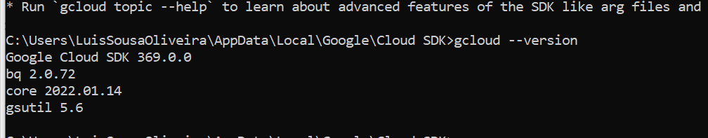
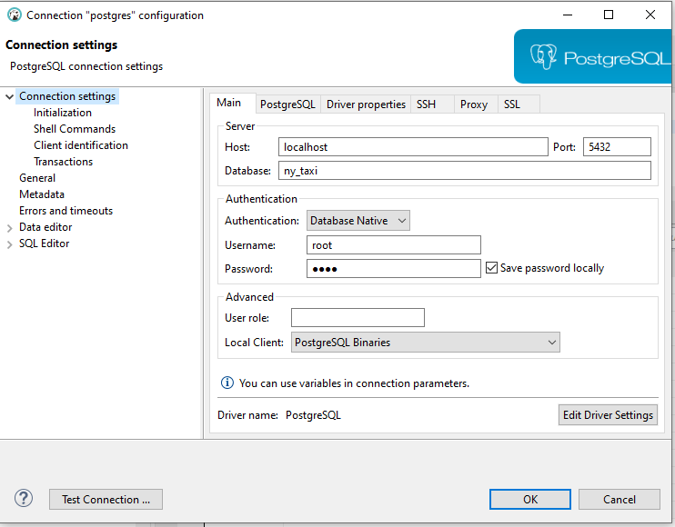
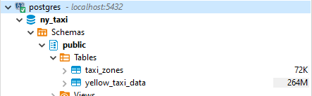
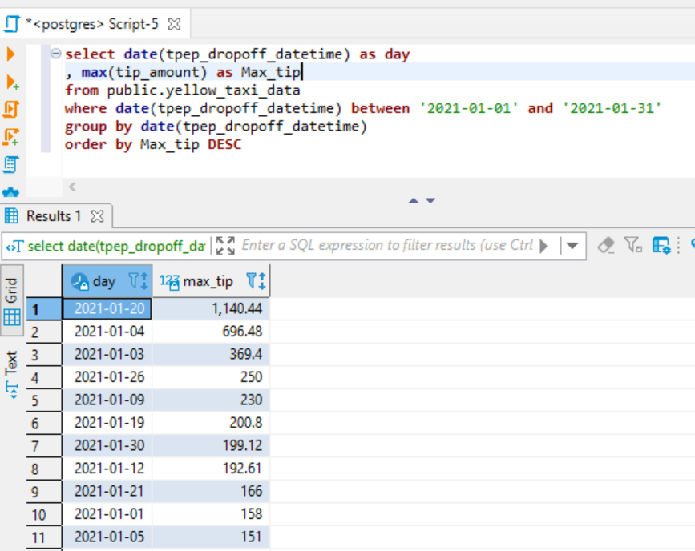
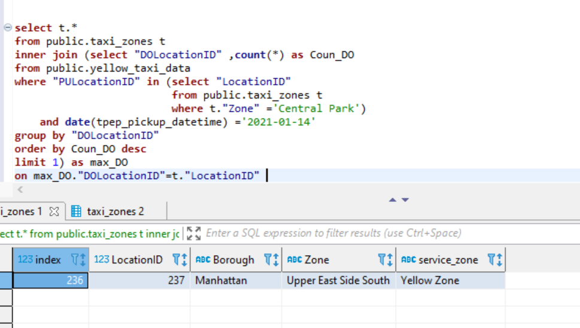
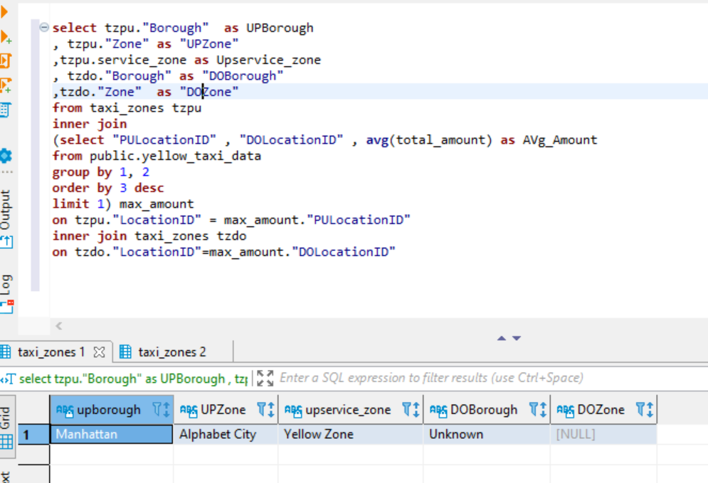

## Week 1 Homework

In this homework we'll prepare the environment 
and practice with terraform and SQL

## Question 1. Google Cloud SDK

Install Google Cloud SDK. What's the version you have? 

To get the version, run `gcloud --version`



`Google Cloud SDK 369.0.0`
`bq 2.0.72`
`core 2022.01.14`
`gsutil 5.6`

Version : `Google Cloud SDK 369.0.0`

## Google Cloud account 

Create an account in Google Cloud and create a project.


## Question 2. Terraform 

Now install terraform and go to the terraform directory (`week_1_basics_n_setup/1_terraform_gcp/terraform`)

After that, run

* `terraform init`
* `terraform plan`
* `terraform apply`

`     + resource "google_bigquery_dataset" "dataset" {
      + creation_time              = (known after apply)
      + dataset_id                 = "trips_data_all"
      + delete_contents_on_destroy = false
      + etag                       = (known after apply)
      + id                         = (known after apply)
      + last_modified_time         = (known after apply)
      + location                   = "europe-west6"
      + project                    = "uplifted-nuance-338810"
      + self_link                  = (known after apply)
`

`      + access {
          + domain         = (known after apply)
          + group_by_email = (known after apply)
          + role           = (known after apply)
          + special_group  = (known after apply)
          + user_by_email  = (known after apply)
`

`+ view {
              + dataset_id = (known after apply)
              + project_id = (known after apply)
              + table_id   = (known after apply)
            }
        }
    }
`

`  + resource "google_storage_bucket" "data-lake-bucket" {
      + force_destroy               = true
      + id                          = (known after apply)
      + location                    = "EUROPE-WEST6"
      + name                        = "dtc_data_lake_uplifted-nuance-338810"
      + project                     = (known after apply)
      + self_link                   = (known after apply)
      + storage_class               = "STANDARD"
      + uniform_bucket_level_access = true
      + url                         = (known after apply)
      + lifecycle_rule {
          + action {
              + type = "Delete"
            }
          + condition {
              + age                   = 30
              + matches_storage_class = []
              + with_state            = (known after apply)
            }
        }
      + versioning {
          + enabled = true
        }
    }
`

`
Plan: 2 to add, 0 to change, 0 to destroy.
Do you want to perform these actions?
  Terraform will perform the actions described above.
  Only 'yes' will be accepted to approve.
google_bigquery_dataset.dataset: Creating...
google_storage_bucket.data-lake-bucket: Creating...
google_storage_bucket.data-lake-bucket: Creation complete after 2s [id=dtc_data_lake_uplifted-nuance-338810]
google_bigquery_dataset.dataset: Creation complete after 2s [id=projects/uplifted-nuance-338810/datasets/trips_data_all]
`

## Prepare Postgres 

Run Postgres and load data as shown in the videos

NOTE: I RAN the queries in DBEAVER connecting to POSTGRES in Docker:





We'll use the yellow taxi trips from January 2021:

```bash
wget https://s3.amazonaws.com/nyc-tlc/trip+data/yellow_tripdata_2021-01.csv
```

Download this data and put it to Postgres

## Question 3. Count records 

How many taxi trips were there on January 15?

```SQL
SELECT count(*)
FROM public.yellow_taxi
WHERE date(tpep_pickup_datetime)='2021-01-15'
```
## Question 4. Average

Find the largest tip for each day. 
On which day it was the largest tip in January?

(note: it's not a typo, it's "tip", not "trip")

```SQL
SELECT date(tpep_dropoff_datetime) as day, max(tip_ammount) as Max_tip
FROM public.yellow_taxi
WHERE date(tpep_dropoff_datetime) BETWEEN '2021-01-01' AND '2021-01-31'
GROUP BY date(tpep_dropoff_datetime)
ORDER BY Max_tip DESC
```

## Question 5. Most popular destination

What was the most popular destination for passengers picked up 
in central park on January 14?

Enter the district name (not id)

```SQL
SELECT t.*
FROM public.taxi_zone t
INNER JOIN (SELECT "DOLocationID", Count(*) as C
            FROM public.yellow_taxi
            WHERE date(tpep_pickup_datetime) = '2021-01-14'
            AND "PULocationID" IN (SELECT "LocationID" as L
                                   FROM public.taxi_zone t1
                                   WHERE t."Zone"='Central Park')
            GROUP BY "DOLocationID"
            ORDER BY C DESC
            LIMIT 1) as MAX_DO
MAX_DO."DOLocationID"=t."Location"   
  ```


## Question 6. 

What's the pickup-dropoff pair with the largest 
average price for a ride (calculated based on `total_amount`)?


```SQL
SELECT t.*
FROM public.taxi_zone t
INNER JOIN (SELECT "DOLocationID", "DOLocationID", Count(*) as C
            FROM public.yellow_taxi
            WHERE date(tpep_pickup_datetime) = '2021-01-14'
            GROUP BY "DOLocationID"
            ORDER BY C DESC
            LIMIT 1) as MAX_DO
MAX_DO."DOLocationID"=t."Location"   
  ```

## Submitting the solutions

Form for sumitting (TBA)

Deadline: 24 January, 17:00 CET


